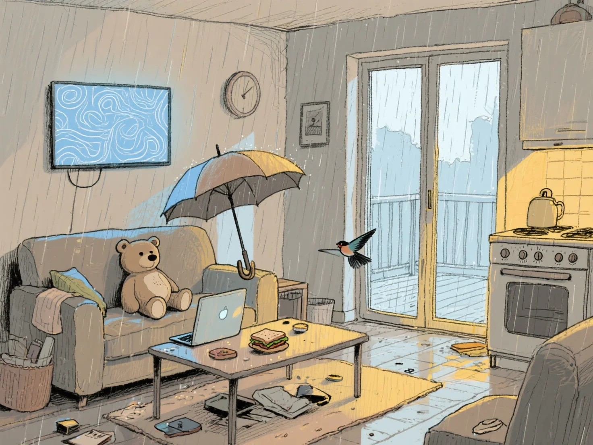
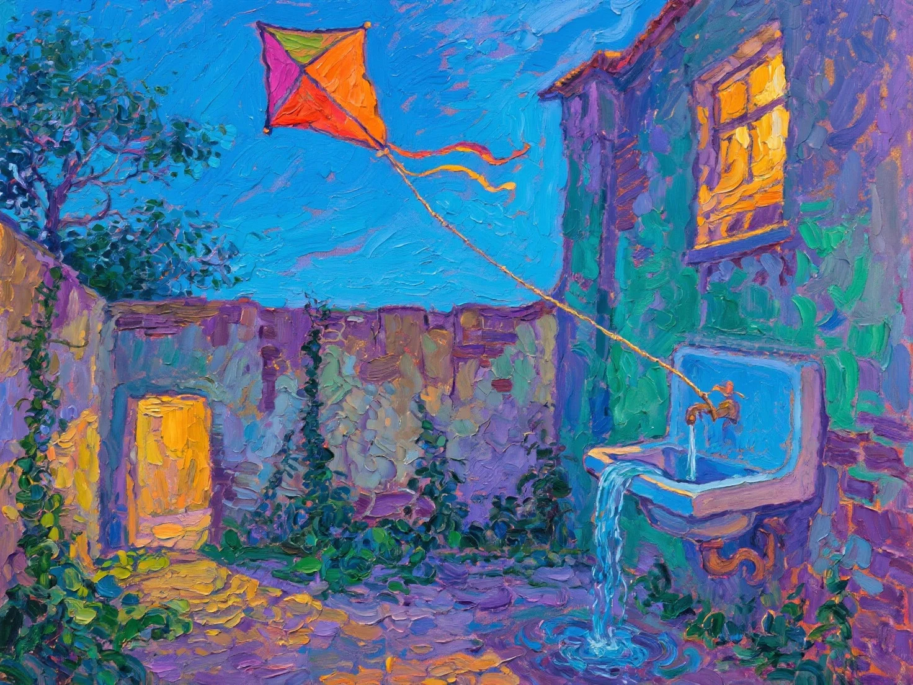
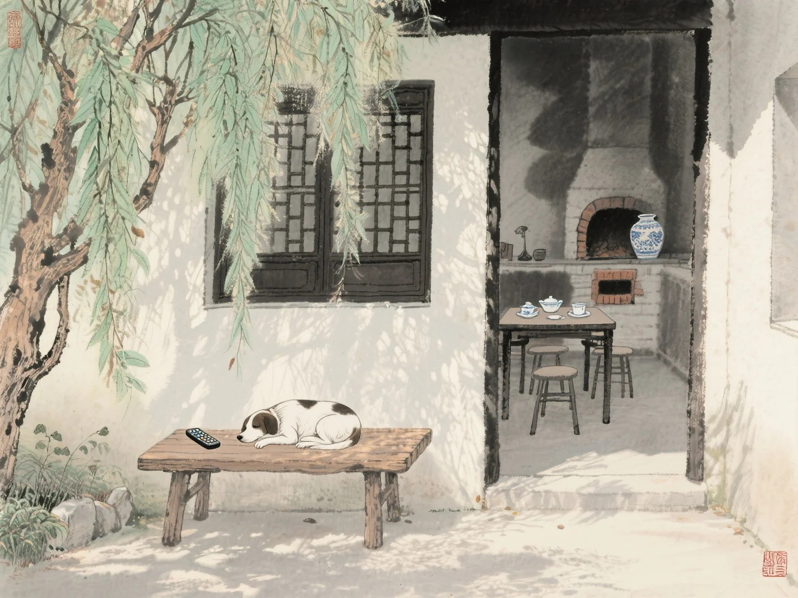

# ARTO-Guided Automated Dataset Generation


This repository contains the implementation and dataset for our paper **"ARTO-Guided Automated Dataset Generation: A Framework for Semantically Rich Artwork Representation"** submitted to CIKM 2025.

## Overview

Traditional artwork dataset creation faces a fundamental trade-off between scale and semantic depth. Our framework addresses this challenge by leveraging the [ARTO (Artwork Object) Ontology](https://w3id.org/arto) to guide automated generation of semantically rich, structured artwork descriptions.

### Key Features

- **Automated Generation**: Fully automated pipeline from object selection to RDF knowledge graphs
- **Intelligent Object Selection**: COCO-based object compatibility validation with conflict resolution
- **Four-Stage Scene Design**: Progressive refinement following ARTO's semantic structure
- **Rich Semantic Annotations**: Average 46.2 RDF triples per artwork with complete ontological compliance
- **Multi-Style Support**: Five artistic styles (Oil Painting, Post-Impressionism, Sketch, Chinese Ink Painting, Photorealistic)
- **High Success Rate**: 98.9% generation success rate with 94.8% unique object combinations


## Quick Start

### Prerequisites

- Python 3.8 or higher
- [Ollama](https://ollama.ai/) with DeepSeek-R1-70B model
- 8GB+ RAM recommended for batch generation

### Installation

1. **Clone the repository**
   ```bash
   git clone https://github.com/SocialMachineLab/ARTO-Gen-Dataset.git
   cd ARTO-Gen-Dataset
   ```

2. **Install dependencies**
   ```bash
   pip install -r requirements.txt
   ```

3. **Setup Ollama and DeepSeek model**
   ```bash
   # Install Ollama (if not already installed)
   curl -fsSL https://ollama.ai/install.sh | sh
   
   # Pull the DeepSeek-R1-70B model
   ollama pull deepseek-r1:70b
   ```

### Basic Usage

#### Generate a Single Artwork

```python
from src.generation.main import IntegratedArtworkPipeline

# Initialize the pipeline
pipeline = IntegratedArtworkPipeline(model_name='deepseek-r1:70b')

# Generate a single artwork
artwork = pipeline.generate_complete_artwork(
    style="Oil Painting",
    max_secondary_objects=6,
    output_dir="my_artworks"
)

print(f"Generated artwork: {artwork['artwork_id']}")
```

#### Batch Generation

```python
# Generate multiple artworks
generated_files = pipeline.batch_generate(
    count=10,
    output_dir="batch_artworks",
    styles=["Post-Impressionism", "Chinese Ink Painting"],
    max_secondary_objects=8
)

print(f"Generated {len(generated_files)} artworks")
```


## Generation Example

Here's a complete walkthrough of generating an Oil Painting artwork from the input objects **person + book**, demonstrating our framework's end-to-end pipeline.

### Input
- **Objects**: person, book
- **Style**: Oil Painting
- **Max Secondary Objects**: 6

### Pipeline Execution

**Step 1 - Object Compatibility**: ✅ Objects are compatible for artistic composition

**Step 2 - Four-Stage Scene Design**:
- *Stage 1 - Scene Framework*: Intimate portrait composition, indoor setting, contemplative nature
- *Stage 2 - Spatial Layout*: Seated figure holding open book, three-quarter viewing perspective  
- *Stage 3 - Environment Details*: Soft window lighting from left, contemporary setting
- *Stage 4 - Artistic Expression*: Warm golden tones, contemplative emotion, knowledge symbolism

**Step 3 - ARTO RDF Generation**: Creates 15 RDF triples with hierarchical artwork relationships

### Generated Outputs

**JSON Metadata**:
```json
{
  "artwork_id": "artwork_20250617_143022_789",
  "style": "Oil Painting",
  "selected_objects": {
    "object_names": ["person", "book"]
  },
  "scene_design": {
    "stage1_scene_framework": {
      "composition_type": "portrait",
      "environment": "indoor",
      "scene_nature": "contemplative and intimate"
    }
  }
}
```

**RDF Knowledge Graph**:
```turtle
:artwork_20250617_143022_789 a arto:Painting ;
    dc:title "The Contemplative Reader" ;
    arto:style "Oil Painting" ;
    arto:containsScene :main_scene .

:main_scene arto:containsObject :person_001, :book_001 .

:person_001 arto:descriptor "young reader in contemplative pose" ;
    arto:state "seated, reading" ;
    arto:relatedTo :book_001 .
```

**Final Image Prompt**: 
> "A contemplative portrait depicting a young reader absorbed in an open book, rendered in warm oil paints. Soft golden light streams from the left, illuminating the figure's concentrated expression and the cream-colored pages. Three-quarter view composition with intimate indoor setting, emphasizing the peaceful connection between reader and text."

### Visual Results

The framework successfully generates diverse artistic styles while maintaining semantic coherence:


***Examples of generated artworks across different styles: Post-Impressionism, Oil Painting, Chinese Ink Painting, and Sketch***






## Dataset

Our pre-generated dataset contains **1,000 artworks** spanning five artistic styles:

- **Post-Impressionism**: 230 artworks (23%)
- **Oil Painting**: 230 artworks (23%)
- **Chinese Ink Painting**: 230 artworks (23%)
- **Sketch**: 160 artworks (16%)
- **Photorealistic**: 150 artworks (15%)

### Dataset Statistics

| Metric | Value |
|--------|-------|
| Total Artworks | 1,000 |
| Unique Object Combinations | 948 (94.8%) |
| Average Objects per Artwork | 5.05 ± 2.57 |
| Average RDF Triples per Artwork | 46.2 ± 13.0 |
| Total Object Instances | 5,052 |
| COCO Categories Covered | 80/80 (100%) |
| Unique Colors Identified | 612 |
| Generation Success Rate | 98.9% |

### File Formats

Each artwork includes:

1. **JSON Metadata** (`artwork_id.json`)
   - Structured scene design data
   - Four-stage generation details
   - Object compatibility information
   - Generation metadata

2. **RDF/TTL Knowledge Graph** (`artwork_id.ttl`)
   - ARTO-compliant semantic representation
   - Hierarchical scene-object-element relationships
   - Complete ontological annotations
   - SPARQL-queryable format

3. **Image Generation Prompt** (embedded in JSON)
   - Optimized for Flux 1.1 Pro
   - Style-specific optimizations
   - Comprehensive scene descriptions

## Framework Architecture

Our framework operates through three main components:

### 1. Intelligent Object Selection
- **Source**: COCO dataset (80 object categories)
- **Process**: Random primary object + 0-8 secondary objects
- **Validation**: LLM-based compatibility checking
- **Resolution**: Systematic conflict removal with frequency-based prioritization

### 2. Four-Stage Scene Design
Following ARTO's semantic hierarchy:

- **Stage 1**: Scene Framework (composition type, environment, nature)
- **Stage 2**: Spatial Layout (relationships, perspective, arrangement)
- **Stage 3**: Environment Details (location, time, weather, lighting)
- **Stage 4**: Artistic Expression (colors, emotions, symbolism, final prompt)

### 3. ARTO RDF Generation
- **Metadata Generation**: Titles, descriptions, medium specifications
- **Object Annotation**: Visual descriptors, states, materials
- **Triple Construction**: Complete ARTO-compliant relationships
- **Validation**: Automated consistency checking

## Evaluation Results

### Semantic Quality
- **Object Compatibility**: 98.4% semantically coherent combinations
- **Scene Coherence**: 96.7% artistically plausible compositions
- **RDF Compliance**: 100% ARTO ontology conformance

### Compositional Diversity
- **Scene Types**: Genre (60.2%), Still Life (34.1%), Landscape (3.3%), Portrait (0.8%)
- **Environment Distribution**: Indoor (38.7%), Outdoor (28.5%), Mixed (32.6%)
- **Perspective Variety**: 96 unique perspective descriptions

### Comparison with Existing Datasets

| Dataset | Size | Annotation Depth | Generation Method | Semantic Richness |
|---------|------|------------------|-------------------|-------------------|
| WikiArt | 80K | Style/Artist | Manual Collection | Low |
| SemArt | 21K | Basic Description | Expert Annotation | Medium |
| **Ours** | **1K** | **ARTO RDF** | **AI-Generated** | **High** |

## Applications

This dataset enables various research applications:

### Computer Vision
- **Artwork Classification**: Style and genre recognition
- **Scene Understanding**: Compositional analysis

### Natural Language Processing
- **Artwork Captioning**: Semantically rich description generation
- **Cross-modal Retrieval**: Text-to-image and image-to-text search

### Digital Humanities

- **Educational Tools**: Interactive art learning systems


## Related Work

- **[ARTO Ontology](https://w3id.org/arto)**: The foundational ontology for artwork representation
- **[COCO Dataset](https://cocodataset.org/)**: Source of object categories

## License

This project is licensed under the MIT License - see the [LICENSE](LICENSE) file for details.
