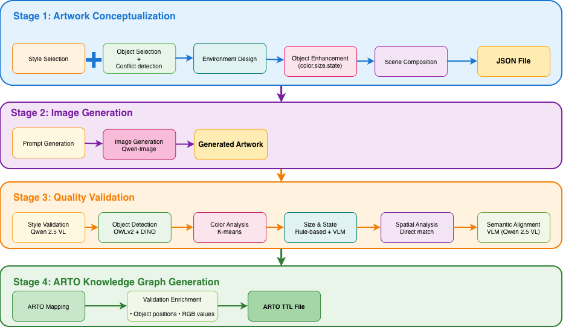

# ARTO-KG: A Synthetic Artwork Dataset for Knowledge-Enhanced Understanding

ARTO-KG is a large-scale synthetic artwork dataset that bridges visual content and structured knowledge through ontology-guided automated generation. Each artwork is annotated with comprehensive RDF knowledge graphs aligned with the ARTO ontology (https://w3id.org/arto).

The complete ARTO-KG dataset (10,108 artworks with images, metadata, and RDF knowledge graphs) is available on Hugging Face: [youngcan1/ARTO-Gen-Dataset](https://huggingface.co/datasets/youngcan1/ARTO-Gen-Dataset)

---

## Dataset Overview

ARTO-KG contains 10,108 high-resolution artworks across five artistic styles, each paired with rich semantic annotations.

### Statistics

- Total Artworks: 10,108
- Object Instances: 39,878 (average 3.95 per artwork)
- RDF Triples: 1,056,970 (average 104.6 per artwork)
- Spatial Relations: 33,579 (90.6% of all relations)
- Semantic Interactions: 3,474 (9.4% of all relations)
- Artistic Styles: 5 (Baroque, Neoclassicism, Impressionism, Post-Impressionism, Chinese Ink Painting)

### Style Distribution

| Style | Count | Key Characteristics |
|-------|-------|---------------------|
| Baroque | 2,000 | Dramatic lighting, indoor focus (89.5%) |
| Neoclassicism | 2,104 | Classical compositions, formal arrangements |
| Impressionism | 2,003 | Light and color emphasis, outdoor scenes |
| Post-Impressionism | 2,001 | Expressive brushwork, rich semantic interactions |
| Chinese Ink Painting | 2,000 | Landscape-oriented, morning/misty atmospheres |

## Key Features

**Structured Knowledge Representation**

ARTO-KG addresses a critical gap in existing artwork datasets: the lack of fine-grained visual semantics for compositional understanding and semantic reasoning. While datasets like Art500K and WikiArt provide high-level metadata (artist, style, genre), and SemArt offers natural language captions, ARTO-KG uniquely encodes explicit visual content as queryable RDF triples:

- **Visual Elements**: Colors with RGB values, textures, materials, composition rules
- **Objects**: Bounding boxes, physical states, symbolic meanings, material properties  
- **Spatial Relations**: Geometric layouts (left_of, on, behind, beside, etc.)
- **Semantic Relations**: Meaningful interactions (holding, watching, playing_with, etc.)

This hierarchical representation spans from low-level visual elements to high-level scene semantics, averaging **104.6 RDF triples per artwork** compared to 7.5 triples in ArtGraph (the only other artwork knowledge graph dataset) and zero structured triples in caption-based datasets.

**Ontology-Guided Generation**

Our automated framework leverages the ARTO ontology to ensure:
- Hierarchical Structure: From low-level visual elements to high-level scene semantics
- Schema Consistency: 100% ARTO-compliant RDF triples
- Semantic Richness: Average 104.6 triples per artwork vs. 7.5 in existing KG datasets

**Multi-Dimensional Quality Validation**

Each artwork undergoes comprehensive validation:
- Style Accuracy: 92.8% (manual verification)
- Object Presence: 98.4% detection accuracy
- Overall Quality: 78.2% mean score across 6 dimensions


## Installation

Requirements:
- Python 3.9-3.11
- CUDA-capable GPU (recommended for validation)

```bash
git clone https://github.com/SocialMachineLab/ARTO-Gen-Dataset.git
cd ARTO-Gen-Dataset
pip install -r requirements.txt
```

Or install as a package:

```bash
pip install -e .
```

## Usage

### Query the Knowledge Graph

```python
from rdflib import Graph

# Load an artwork's knowledge graph
g = Graph()
g.parse("data/rdf/artwork_20260103_022646_126.ttl", format="turtle")

# SPARQL query: Find all objects in the scene
query = """
PREFIX arto: <https://w3id.org/arto#>
PREFIX rdfs: <http://www.w3.org/2000/01/rdf-schema#>

SELECT ?object ?label WHERE {
    ?scene arto:containsObject ?object .
    ?object rdfs:label ?label .
}
"""

for row in g.query(query):
    print(f"Object: {row.label}")
```

### Generate New Artworks

```bash
# Run the complete pipeline
python -m arto_kg.conceptualization.main \
    --style "Impressionism" \
    --num_objects 5 \
    --output_dir ./outputs

# Generate images from JSON specifications
python -m arto_kg.generation.main \
    --input_dir ./outputs/json \
    --output_dir ./outputs/images \
    --model qwen
```

### Validate Generated Artworks

```bash
python -m arto_kg.validation.batch_processor \
    --input_dir ./outputs/json \
    --image_dir ./outputs/images \
    --od_dir ./outputs/detection \
    --output_dir ./outputs/validation
```

## Repository Structure

```
ARTO-Gen-Dataset/
├── arto_kg/                      # Core package
│   ├── conceptualization/        # Artwork design (LLM-based)
│   │   ├── object_selector.py    # COCO-based object selection
│   │   ├── scene_composer.py     # Spatial & semantic relations
│   │   ├── environment_designer.py # Lighting, weather, atmosphere
│   │   ├── object_enhancer.py    # Object attributes
│   │   └── prompt_generator.py   # Image generation prompts
│   ├── generation/               # Image generation
│   │   └── main.py               # Qwen-Image integration
│   ├── validation/               # Quality assurance
│   │   ├── batch_processor.py    # Multi-step validation
│   │   └── validators/           # Specialized validators
│   ├── knowledge_graph/          # RDF generation
│   │   ├── run_kg_assembly.py    # JSON to TTL converter
│   │   └── arto_mapper.py        # ARTO ontology mapping
│   └── config/                   # Configuration files
├── experiments/                  # Research experiments
│   ├── multimodel_generation/    # Multi-model comparison experiments
│   ├── object_detection/         # Object detection validation
│   └── style_feature_analysis/   # Style feature extraction
```

## Generation Framework


*Figure: ARTO-KG automated generation pipeline from object selection to RDF knowledge graph generation*

Our automated pipeline consists of four main stages:

**Stage 1: Artwork Conceptualization**

Intelligent Object Selection:
- Two-layer mechanism: COCO categories mapped to style-specific varieties
- Example: "person" becomes "baroque nobleman" or "impressionist dancer"
- Conflict detection via LLM-based reasoning

Environment Design:
- Spatial classification (Place365 taxonomy)
- Weather conditions (WMO standards)
- Temporal attributes (time period, time of day)
- Lighting and color schemes

Scene Composition:
- Spatial relations: left_of, on, behind, beside, etc.
- Semantic relations: holding, watching, playing_with, etc.

**Stage 2: Image Generation**

- Model: Qwen-Image (1024×1024 resolution, 80 inference steps)
- Prompt Optimization: Style-specific prompt engineering
- Performance: ~0.5 min per artwork on NVIDIA A100

**Stage 3: Quality Validation**

| Validator | Method | Accuracy |
|-----------|--------|----------|
| Style | Qwen 2.5 VL (zero-shot) | 92.8% |
| Object Detection | OWLv2 + Grounding DINO | 98.4% |
| Color | K-means + LAB space | 51.1% |
| Size | BBox area analysis | 71.5% |
| State | VLM-based verification | 89.2% |
| Spatial | Geometric + VLM | 89.8% |

**Stage 4: Knowledge Graph Generation**

- Format: RDF/Turtle (TTL)
- Ontology: ARTO-compliant
- Enrichment: Integrates validation results (bboxes, verified colors)
- Performance: ~0.1 min per artwork

## Example: Generation Walkthrough

Input: lamb, lamp post, iris, table, wine bottle (Post-Impressionism style)

**Step 1 - Conflict Detection**

The system identified a conflict between pastoral object (lamb) and dining objects (table, wine bottle). The LLM generated 8 possible scenarios including "country garden at dusk" and "artistic courtyard". The system selected "artistic courtyard" to enable coherent coexistence.

**Step 2 - Environment Design**

Setting: Sunset, cloudy weather, mixed lighting. The iris petals acquire velvety violet tones, and the lamp post casts warm amber glow.

**Step 3 - Scene Composition**

```json
{
  "spatial_relations": [
    {"subject": "wine_bottle", "relation": "on", "object": "table"},
    {"subject": "lamb", "relation": "beside", "object": "table"},
    {"subject": "lamp_post", "relation": "behind", "object": "table"},
    {"subject": "iris", "relation": "beside", "object": "table"}
  ]
}
```

**Step 4 - RDF Output**

```turtle
:lamb arto:nextTo :table ;
      arto:hasSize "Medium" ;
      arto:hasState "Peaceful, still posture" .
:wine_bottle arto:on :table .
:lamp_post arto:behind :table, :iris, :lamb .
```

## Applications

ARTO-KG's structured knowledge representation enables a wide range of research applications across multiple domains. The dataset's comprehensive RDF annotations support tasks requiring deep compositional understanding, including scene graph generation, object relationship detection, and visual semantic reasoning. For multimodal AI research, the dataset bridges visual content and structured knowledge, supporting artwork captioning, visual question answering, and cross-modal understanding. In digital humanities, the ARTO-compliant annotations enable computational analysis and digital curation of artistic content. The controllable generation framework also addresses long-tail distribution problems in real artwork datasets by synthesizing rare style-object combinations with specific attributes.

**Scene Graph Generation**

The dataset contains 37,053 object relationships (90.6% spatial, 9.4% semantic) with complexity ranging from simple relations with 1-3 objects (49.2%) to complex compositions with 7+ objects (16.8%).

**Semantic Retrieval**

SPARQL-based queries achieve 100% Precision@5 compared to 46% (CLIP) and 53% (text retrieval):

```sparql
# Find Baroque paintings with a person holding a book
PREFIX arto: <https://w3id.org/arto#>

SELECT ?artwork ?title WHERE {
    ?artwork arto:style "Baroque" ;
             dc:title ?title ;
             arto:containsScene ?scene .
    ?scene arto:containsObject ?person, ?book .
    ?person rdfs:label "person" ;
            arto:holding ?book .
    ?book rdfs:label "book" .
}
```

**Data Augmentation**

The framework can generate rare style-object combinations to address long-tail distribution problems in real artwork datasets, providing controllable evaluation of compositional understanding.

## Dataset Comparison

| Dataset | Size | Annotation Type | Triples/Image | Visual Content |
|---------|------|----------------|---------------|----------------|
| Art500k | 500k | Style/Artist Labels | - | No |
| OmniArt | 432k | Metadata + IconClass | - | No |
| ArtGraph | 116k | Metadata KG | 7.5 | No |
| WikiArt | 80k | Style/Genre | - | No |
| SemArt | 21k | Captions + Metadata | - | No |
| DEArt | 15k | Bounding Boxes | - | Partial |
| ARTO-KG | 10k | Visual Content RDF | 104.6 | Yes |

## Configuration

### Environment Variables

```bash
# VLM media access path (for validation)
export VLLM_MEDIA_PATH=/path/to/ARTO-Gen-Dataset

# Optional: Custom model paths
export CONCEPTUALIZATION_LLM="GPT-OSS 120B"
export VALIDATION_VLM="Qwen/Qwen2.5-VL-32B-Instruct-AWQ"
```


### Hardware Requirements

| Task              | GPU          | VRAM  | CPU RAM |
| ------------------- | -------------- | ------- | --------- |
| Conceptualization | Required     | 40GB+ | 32GB    |
| Image Generation  | Required     | 20GB+ | 32GB    |
| Validation        | Required     | 20GB+ | 32GB    |
| KG Assembly       | Not required | -     | 8GB     |

## License

This project is licensed under the MIT License - see the LICENSE file for details.

## Related Resources

- **Dataset**: [Hugging Face - youngcan1/ARTO-Gen-Dataset](https://huggingface.co/datasets/youngcan1/ARTO-Gen-Dataset)
- **ARTO Ontology**: https://w3id.org/arto
- **Code Repository**: https://github.com/SocialMachineLab/ARTO-Gen-Dataset

## Contact

Maintained by Social Machine Lab, Australian National University

Email: Can.Yang@anu.edu.au
